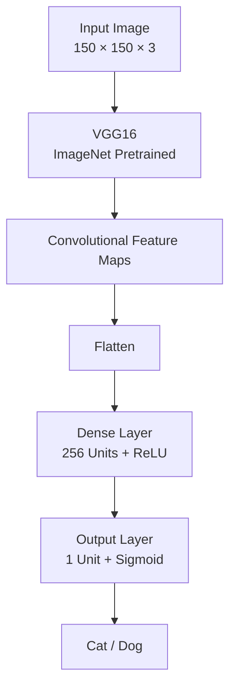
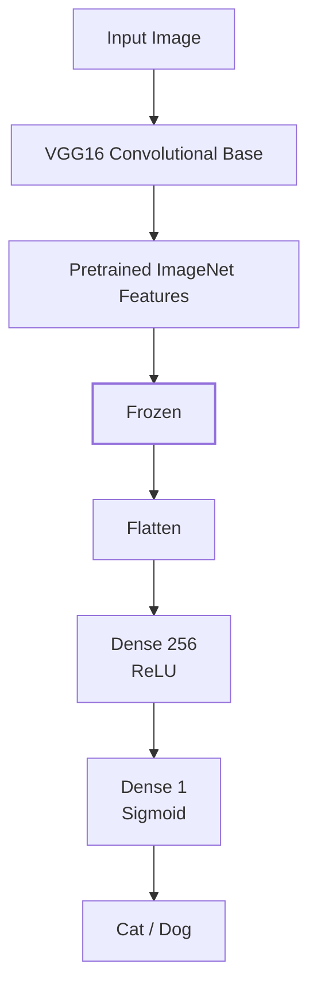
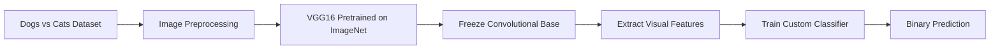
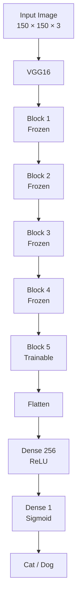
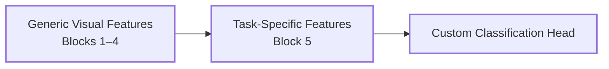
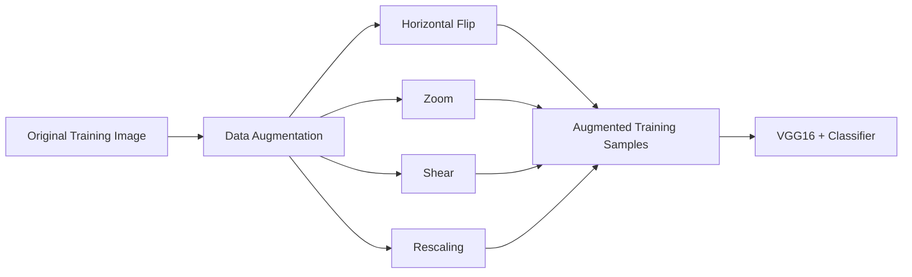
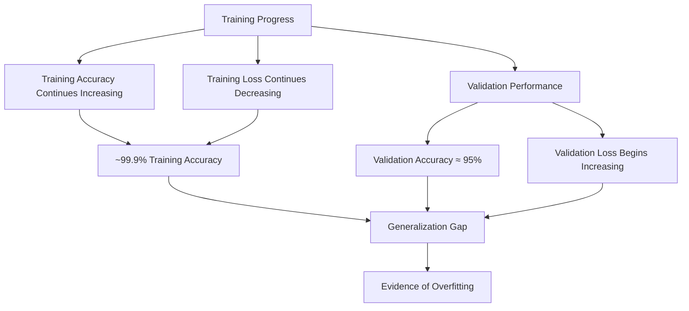
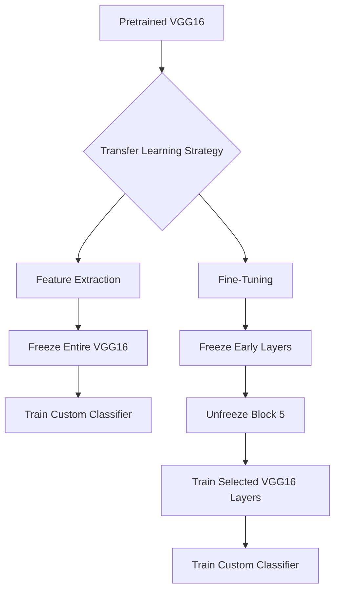
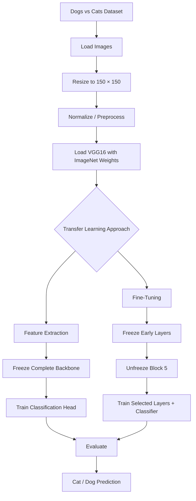
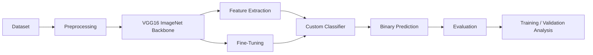

# Transfer Learning for Image Classification

A comparative deep learning project demonstrating two transfer learning strategies using a pretrained VGG16 convolutional neural network for binary image classification of cats and dogs.

The project implements and compares:

1. Feature Extraction using a frozen pretrained VGG16 backbone.
2. Fine-Tuning using a partially unfrozen VGG16 backbone.

The objective is to understand how pretrained convolutional representations can be reused and subsequently adapted to a new computer vision task.

---

## Project Overview

Training a convolutional neural network from scratch requires substantial computational resources and a large amount of labelled data. Transfer learning addresses this problem by reusing knowledge learned from a model trained on a large-scale dataset such as ImageNet.

In this project, VGG16 pretrained on ImageNet is used as the convolutional backbone. Two different transfer learning strategies are implemented to classify images into two categories:

- Cat
- Dog

The experiments demonstrate the difference between using pretrained features directly and allowing higher-level pretrained features to adapt to the target dataset.

---

## Repository Structure

```text
Transfer-Learning/
│
├── Feature-Extraction-Method.ipynb
├── Finetuning-Method.ipynb
└── README.md
```

### Notebooks

| Notebook | Description |
|---|---|
| `Feature-Extraction-Method.ipynb` | Implements transfer learning by freezing the complete VGG16 convolutional base |
| `Finetuning-Method.ipynb` | Implements transfer learning by freezing early VGG16 layers and fine-tuning the final convolutional block |

---

## Dataset

The project uses a Dogs vs Cats image classification dataset.

| Property | Value |
|---|---:|
| Training images | 20,000 |
| Validation/Test images | 5,000 |
| Number of classes | 2 |
| Input image size | 150 × 150 |
| Channels | 3 (RGB) |
| Task | Binary Classification |

The dataset is organized into separate training and testing directories with one directory per class.

```text
dogsvscats/
│
├── train/
│   ├── cats/
│   └── dogs/
│
└── test/
    ├── cats/
    └── dogs/
```

---

# Model Architecture

Both experiments use VGG16 pretrained on ImageNet as the convolutional feature extractor.

The original ImageNet classification head is removed using:

```python
VGG16(
    weights="imagenet",
    include_top=False,
    input_shape=(150, 150, 3)
)
```

A custom binary classification head is then added.



The final sigmoid neuron produces a probability for binary classification.

---

# 1. Feature Extraction

## Approach

In the feature extraction approach, the complete pretrained VGG16 convolutional base is frozen.

The pretrained convolutional layers are used as a fixed feature extractor, while only the newly added classification head is trained on the Dogs vs Cats dataset.

```python
conv_base.trainable = False
```

The architecture can be represented as:



### Trainable Parameters

The VGG16 convolutional base contains approximately:

```text
14.7 million parameters
```

When the convolutional base is frozen, these parameters are no longer updated during training.

The custom classification head contains approximately:

```text
2.1 million trainable parameters
```

Therefore, the optimization process focuses primarily on learning the new classifier rather than modifying the pretrained visual representations.

---

## Feature Extraction Workflow



---

## Advantages

- Lower computational cost compared with training the complete network.
- Faster training.
- Fewer trainable parameters.
- Lower risk of destroying useful pretrained representations.
- Effective when the target dataset is relatively small.

## Limitations

- The pretrained convolutional features cannot adapt to the target dataset.
- The representation learned from ImageNet may not be optimal for the specific classification task.
- The final performance can be limited by the fixed feature representation.

---

# 2. Fine-Tuning

## Approach

Fine-tuning extends feature extraction by allowing selected layers of the pretrained network to become trainable.

The earlier VGG16 layers are frozen because they generally learn more generic visual features such as:

- Edges
- Textures
- Basic shapes
- Low-level visual patterns

The later layers are more task-specific, so the final convolutional block is unfrozen and adapted to the Dogs vs Cats classification task.

The implementation selectively unfreezes VGG16 starting from `block5_conv1`.

```python
conv_base.trainable = True

set_trainable = False

for layer in conv_base.layers:
    if layer.name == "block5_conv1":
        set_trainable = True

    if set_trainable:
        layer.trainable = True
    else:
        layer.trainable = False
```

---

## Fine-Tuning Architecture



The transfer learning strategy can therefore be summarized as:

```text
Early VGG16 Layers  → Frozen
Later VGG16 Layers  → Fine-Tuned
Custom Classifier   → Fully Trainable
```

---

# Fine-Tuning Strategy

The VGG16 network is divided conceptually into two sections:



The earlier layers retain the general visual knowledge learned from ImageNet, while the later layers are allowed to specialize for the target classification problem.

---

# Training Configuration

The fine-tuning experiment uses a small learning rate to avoid making large destructive updates to the pretrained weights.

```python
optimizer = RMSprop(learning_rate=1e-5)
loss = "binary_crossentropy"
metrics = ["accuracy"]
```

### Configuration

| Parameter | Value |
|---|---|
| Optimizer | RMSprop |
| Learning Rate | `1e-5` |
| Loss Function | Binary Crossentropy |
| Metric | Accuracy |
| Batch Size | 32 |
| Image Size | 150 × 150 |
| Epochs | 10 |

A low learning rate is particularly important during fine-tuning because the pretrained network already contains useful visual representations.

---

# Image Preprocessing

The images are resized to:

```text
150 × 150 × 3
```

For the fine-tuning experiment, pixel values are normalized using:

```python
image = tensorflow.cast(image / 255, tensorflow.float32)
```

VGG16-specific preprocessing is also explored in the feature extraction notebook using:

```python
from tensorflow.keras.applications.vgg16 import preprocess_input
```

The preprocessing strategy should be kept consistent with the assumptions of the pretrained model when reproducing the experiments.

---

# Data Augmentation

The project also explores data augmentation to increase the effective diversity of the training dataset.

The augmentation pipeline includes:

```python
ImageDataGenerator(
    rescale=1./255,
    shear_range=0.2,
    zoom_range=0.2,
    horizontal_flip=True
)
```

The augmentation operations include:

- Rescaling
- Shearing
- Zooming
- Horizontal flipping

The purpose is to expose the model to different variations of the same underlying images and potentially improve generalization.



---

# Training Results

The fine-tuning experiment was trained for 10 epochs.

The final observed training metrics were:

| Metric | Final Value |
|---|---:|
| Training Accuracy | 99.88% |
| Validation Accuracy | 95.42% |
| Training Loss | 0.0049 |
| Validation Loss | 0.1786 |

### Final Epoch

```text
Epoch 10/10

accuracy:      0.9988
loss:          0.0049

val_accuracy:  0.9542
val_loss:      0.1786
```

---

# Training Behaviour

The training curves reveal an important difference between training and validation performance.



The training accuracy approaches 100%, while validation accuracy remains around 95%.

At the same time, validation loss increases after reaching its lower region.

This indicates that the model is increasingly fitting the training data without achieving equivalent improvements on unseen data.

---

# Overfitting Analysis

The fine-tuning experiment demonstrates a common characteristic of transfer learning.

```text
Training Accuracy     → 99.88%
Validation Accuracy   → 95.42%

Training Loss         → 0.0049
Validation Loss       → 0.1786
```

The gap between training and validation performance indicates overfitting.

This does not mean that the model is unusable. A validation accuracy above 95% indicates that the model has learned useful representations for the classification task.

However, the training curves suggest that continuing to train the model without additional regularization would likely provide diminishing or negative returns on unseen data.

Potential improvements include:

- Early stopping
- Stronger data augmentation
- Dropout
- L2 regularization
- Learning-rate scheduling
- Unfreezing fewer layers
- Reducing the number of training epochs
- Using a more modern architecture such as EfficientNet or MobileNet

---

# Feature Extraction vs Fine-Tuning

The two experiments differ primarily in how much of the pretrained VGG16 network is allowed to adapt.



---

## Comparison

| Characteristic | Feature Extraction | Fine-Tuning |
|---|---|---|
| Backbone | VGG16 | VGG16 |
| Pretrained Weights | ImageNet | ImageNet |
| Convolutional Base | Fully Frozen | Partially Trainable |
| Trainable VGG16 Layers | None | Block 5 |
| Custom Classifier | Trainable | Trainable |
| Computational Cost | Lower | Higher |
| Training Speed | Faster | Slower |
| Adaptability | Lower | Higher |
| Overfitting Risk | Lower | Higher |
| Learning Rate | Standard | Very Small |
| Main Objective | Reuse learned features | Adapt learned features |

---

# Transfer Learning Pipeline

The complete project workflow can be summarized as follows:



---

# Key Concepts Demonstrated

This project covers the following deep learning concepts:

- Transfer Learning
- Convolutional Neural Networks
- VGG16 Architecture
- ImageNet Pretrained Models
- Feature Extraction
- Fine-Tuning
- Layer Freezing
- Selective Layer Unfreezing
- Binary Image Classification
- Image Preprocessing
- Data Augmentation
- Model Training
- Validation
- Training and Validation Curves
- Overfitting Analysis
- Model Generalization

---

# Technologies Used

```text
Python
TensorFlow
Keras
VGG16
NumPy
Matplotlib
Jupyter Notebook
Kaggle
```

---

# Installation

Clone the repository:

```bash
git clone https://github.com/harkirat-data/Transfer-Learning.git
cd Transfer-Learning
```

Install the required dependencies:

```bash
pip install tensorflow numpy matplotlib
```

For the complete notebook environment, additional packages may be required depending on the execution environment.

---

# Running the Project

Open either notebook:

```text
Feature-Extraction-Method.ipynb
```

or:

```text
Finetuning-Method.ipynb
```

Then execute the notebook cells sequentially after configuring the dataset path.

The notebooks were originally developed in a Kaggle environment, so dataset paths may need to be modified when running locally or in another environment.

---

# Project Workflow



---

# Results and Observations

The experiments demonstrate that both transfer learning strategies can effectively solve image classification problems without training a CNN completely from scratch.

Feature extraction provides a computationally efficient approach by keeping the pretrained convolutional representation fixed.

Fine-tuning provides greater flexibility by allowing higher-level convolutional features to adapt to the target dataset.

In the fine-tuning experiment, the model achieved:

```text
Training Accuracy   : 99.88%
Validation Accuracy : 95.42%
```

The difference between training and validation performance also highlights the importance of monitoring generalization rather than relying solely on training accuracy.

---

# Limitations

The current implementation has several limitations:

1. VGG16 is relatively large compared with newer lightweight architectures.
2. The fine-tuned model shows a noticeable training-validation gap.
3. The experiments use a fixed input resolution of 150 × 150.
4. Hyperparameter tuning is limited.
5. No dedicated test-set evaluation is included beyond the validation/test setup used in the notebooks.
6. The feature extraction experiment was interrupted during training, so a directly comparable final accuracy should not be inferred from that notebook.

---
